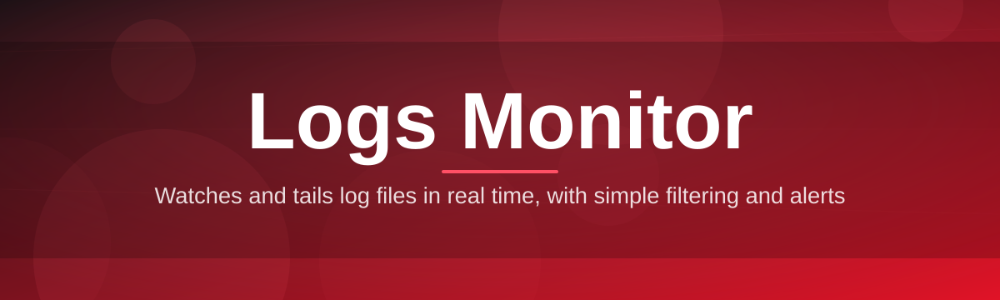
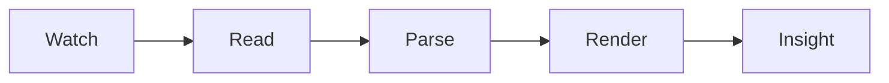

# lm-log-monitor-suite 📊🔥

  

*Your log files, finally behaving like a dashboard instead of a wall of text.*

  

## 🌱 Overview

`lm-log-monitor-suite` started as a weekend itch — I was tailing five different log files across three terminal windows, squinting at timestamps, and thinking "this is 2026, my logs should not be fighting me." So I built the tool I wished existed: a single, focused **Logs Monitor** for Windows that watches your log files in real time, highlights the moments that matter, and gets out of your way otherwise.

This isn't a bloated enterprise observability platform with a fifteen-step onboarding wizard. It's a lean, standalone log monitor built for developers, sysadmins, and support engineers who just need to *see what's happening right now* — tail multiple sources, filter noise, catch error spikes, and export what matters. No agents to deploy, no accounts to create, no telemetry phoning home in the background.

Since the first public build, this project has grown into something the community actively shapes — issues get triaged fast, feature requests turn into releases, and the log-monitoring workflow keeps getting sharper release after release. If you've ever lost ten minutes scrolling through a log file looking for the one line that explains why a service fell over, this tool was built for that exact moment.

  

---

## ⚡ What It Actually Does

> [!TIP]
> Every capability below runs locally. Your log data never leaves your machine.

- **Live tailing, minus the lag** — streams new log lines the instant they're written, with zero perceptible delay even on chatty, high-throughput files.

- **Pattern-aware highlighting** — errors, warnings, and custom regex matches get color-coded automatically so critical lines jump off the screen.

- **Multi-source watching** — monitor several log files or directories side by side in one window instead of juggling terminal tabs.

- **Smart filtering & search** — narrow thousands of lines down to the ten that matter using live filters, saved queries, and instant search-as-you-type.

- **Spike & anomaly cues** — the monitor flags sudden bursts of errors or repeated patterns so you notice trouble before a user reports it.

- **Session snapshots** — freeze the current view, annotate it, and export a clean slice of the log for a bug report or postmortem.

- **Rotation-safe reading** — automatically re-attaches when a log file rotates or truncates, so you never lose your tail mid-incident.

- **Lightweight footprint** — a native, standalone Windows app with no runtime dependencies and a startup time measured in milliseconds.

---

## 🚀 Getting Started

1. Hit the download button above (or below) to reach the official landing page.

2. Grab the latest Windows build — no bundled extras, no dependency chasing.

3. Launch the executable directly; there's no setup wizard standing between you and your logs.

4. Point it at a log file or folder, and watch the stream come alive.

> [!NOTE]
> First run may take a moment while Windows verifies the executable. That's normal — subsequent launches are instant.

---

## 🖥️ Requirements Matrix

| Component | Minimum | Recommended |
|---|---|---|
| **OS** | Windows 10 (64-bit) | Windows 11 (64-bit) |
| **RAM** | 2 GB | 4 GB+ |
| **Disk** | 150 MB free | 300 MB free |
| **Dependencies** | None | None |
| **.NET / Runtime** | Not required | Not required |

> [!IMPORTANT]
> `lm-log-monitor-suite` is a standalone Windows application. There is nothing to compile, no runtime to preinstall, and no background service to configure.

---

## 🧩 How It Works

The monitor is built around a simple, predictable pipeline — no hidden magic, just a clean read-parse-render loop that keeps everything responsive:

1. **Watch** — a file-system watcher detects writes, rotations, and truncations on your chosen log sources.

2. **Read** — new bytes are read incrementally, so massive log files never get fully reloaded into memory.

3. **Parse** — each line is matched against your active filters, regex rules, and severity patterns.

4. **Render** — matching lines are pushed into the live view with highlighting, counters, and spike indicators updated in place.

5. **Snapshot (optional)** — at any point you can freeze the current view and export it for sharing or archiving.

---

## 🛟 Troubleshooting

<strong>The monitor shows "file locked" and won't open my log.</strong>

Some applications write logs with an exclusive lock. Close the writing process briefly, or point the monitor at a copy of the file to confirm it isn't a permissions issue.

<strong>New lines aren't appearing even though the file is growing.</strong>

Check whether the log is being rewritten from scratch versus appended to. The monitor is optimized for append-only logs; fully rewritten files may need a manual refresh.

<strong>Highlighting rules aren't matching my custom log format.</strong>

Regex patterns are case-sensitive by default. Open Settings → Pattern Rules and toggle case-insensitive matching, or adjust your capture groups.

<strong>The app feels slow on a multi-gigabyte log file.</strong>

Enable "tail-only mode" in Settings so the monitor reads from the current end of the file instead of indexing historical content first.

<strong>Can I monitor logs on a network drive?</strong>

Yes, though performance depends on the reliability of the file-change notifications from that network path. Local and mapped drives tend to perform best.

---

## 🎨 UI / UX Details

- **Themes** — Light, Dark, and a high-contrast mode for long monitoring sessions.

- **Keyboard shortcuts**:

  - `Ctrl + T` — open a new tail tab
  - `Ctrl + F` — jump to live search
  - `Ctrl + K` — clear current filters
  - `Ctrl + S` — save a session snapshot
  - `F5` — force refresh the active source

- **Layout** — split-pane view for comparing two log streams side by side.

- **Settings persistence** — your filters, themes, and pattern rules are remembered between launches.

> [!TIP]
> Pin your most-used log sources to the sidebar so a fresh launch drops you straight back into monitoring.

---

## 🤝 Contributing & Community

This project grew because people who actually stare at logs all day kept sending in ideas, bug reports, and pattern-matching improvements. That energy is welcome and encouraged.

- Open an issue for bugs, quirky log formats, or feature ideas.

- Submit a pull request — small, focused changes are reviewed fast.

- Share your custom highlighting rules or filter presets with the community.

> [!WARNING]
> Please avoid pasting sensitive production log data into public issues — sanitize timestamps, hostnames, and credentials first.

---

## 📄 License

Released under the [MIT License](LICENSE), 2026. Use it, fork it, ship it inside your own tooling — just keep the license notice intact.

---

## ⚠️ Disclaimer

`lm-log-monitor-suite` is provided as-is, built and maintained as a passion project. It is a monitoring and visualization aid — always verify critical findings against your original log sources before making operational decisions. No warranty is expressed or implied.

  

